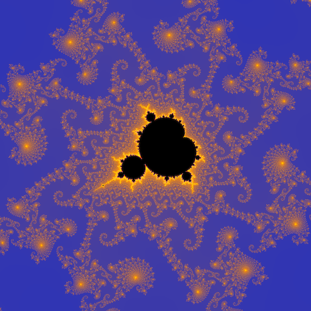

# `mandelbrot`



*An image generated with:*

```
./mandelbrot -c -0.743643135/0.131825963 -d 0.000014628/0.000014628 -n -i 2048 -p 02d/f80/ff0/f00/fff -w 2048
```

*and scaled to 512x512 to simulate 4x antialiasing.*

`mandelbrot` generates PPM images of specified regions of a fractal. It can
generate the [Mandelbrot set](https://en.wikipedia.org/wiki/Mandelbrot_set) (and
[multibrots](https://en.wikipedia.org/wiki/Multibrot_set) with greater exponents),
the [Mandelbar](https://en.wikipedia.org/wiki/Mandelbar) or tricorn, the
[Burning Ship](https://en.wikipedia.org/wiki/Burning_Ship_fractal), or [Julia
sets](https://en.wikipedia.org/wiki/Julia_set) for any of those fractals.

The region to generate is specified by a center point on the complex plane, and
a width and height. The maximum number of iterations and the escape radius are
both customizable.

The default image is grayscale, but it is possible to specify a custom palette.
This is done by interpolating "keyframe" colors. If the user selects black
(#000000), red (#FF0000), and blue (#0000FF), `mandelbrot` will create a palette
with 511 colors: first a gradient from black to red, then from red to blue.
Colors are written as hexadecimal RGB triples. Points inside the set itself are
colored separately, with black as the default.

Two algorithms for choosing colors for points are available: the escape time
algorithm, which is fast but can create aliased "bands" of color; or the
normalized iteration count algorithm, which renders continuous colors.

The only optimizations I made are to check if a point is in the main cardioid
or the period-2 bulbs before testing to see if it escapes. Periodicity checking,
multithreading, and other techniques would make it much faster.

In the future, I may add more features, such as:

 * Support for more common image formats like PNG or GIF. For now, use a program
   like [ImageMagick](http://www.imagemagick.org/) to convert the images.
 * Antialiasing via supersampling. For now, to antialias an image, render it at
   two or three times the required size and resize it.
 * Optimizations like periodicity checking and multithreading.

## Built-in help

```
NAME
        mandelbrot - generates an image of the Mandelbrot set or certain
                     related fractals

SYNOPSIS
        mandelbrot [OPTION]... [FILE]

DESCRIPTION
        Generates a PPM image of the Mandelbrot set or certain related fractals.

        -w, --width=WIDTH
                image width in pixels (default 640)

        -c, --center=X/Y
                center coordinates (default 0/0)

        -d, --dim=W/H
                region dimensions (default 4/4)

        -i, --iterations=IMAX
                maximum number of iterations (default 128)

        -r, --radius=RADIUS
                escape radius (default 2)

        -s, --set=SET
                select the fractal to generate (default 0)
                0   Mandelbrot
                1   Mandelbar
                2   Burning ship
                3+  Multibrot

        -j, --julia=JR/JI
                generate a Julia set for the chosen fractal

        -n, --normalize
                use normalized iteration count (smooth gradients, but slower)

        -e, --color=RRGGBB/RGB
                color for unescaped points in the set (default 000)

        -p, --palette=RRGGBB/RGB/...
                "keyframe" colors for a palette (default 000/FFF)

        -h, --help
                display this help and exit

        With no FILE, or when FILE is -, write to standard output.

AUTHOR
        Written by Remy Oukaour <remy.oukaour@gmail.com>.

COPYRIGHT
        Copyright (C) 2011-2016 Remy Oukaour <http://www.remyoukaour.com>.
        MIT License.
        This is free software: you are free to change and redistribute it.
        There is NO WARRANTY, to the extent permitted by law.
```
